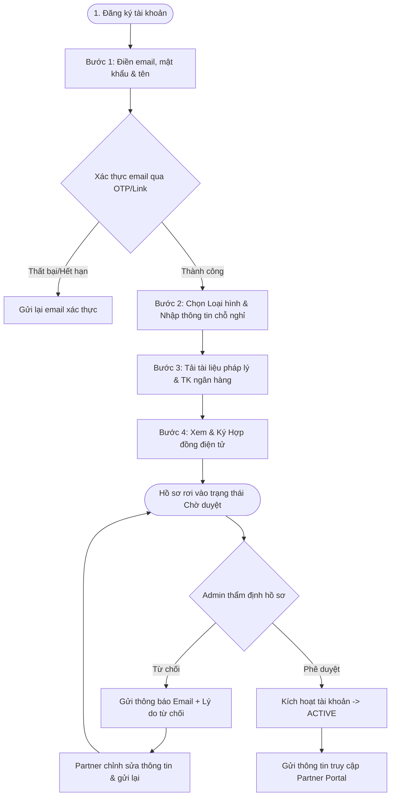

# BKS System - Kế Hoạch Thiết Kế & Triển Khai Cơ Chế Đăng Ký Đối Tác (Partner) Mới

Tài liệu này trình bày chi tiết kế hoạch thiết kế và triển khai cơ chế đăng ký đối tác mới cho hệ sinh thái **BKS System**, áp dụng mô hình biểu mẫu đa bước (**Multi-step Wizard**) kết hợp luồng phê duyệt từ quản trị viên (**Admin Approval Verification Loop**) tương đương tiêu chuẩn các hệ thống lớn (Agoda, Traveloka, Grab).

---

## 1. Phân Khúc Đối Tác Mục Tiêu (4 Loại Hình)
Hệ thống tập trung tối ưu hóa quy trình đăng ký cho **4 loại hình đối tác lưu trú** chính sau:

1. **Khách sạn (Hotel):** Doanh nghiệp có Giấy phép đăng ký kinh doanh (GPKD), mã số thuế, sơ đồ phòng lớn, nhiều dịch vụ đi kèm. Đòi hỏi xác thực pháp nhân kỹ lưỡng.
2. **Nhà nghỉ / Guesthouse:** Hộ kinh doanh cá thể hoặc doanh nghiệp nhỏ. Quy trình xác thực tương đương Khách sạn nhưng quy mô phòng và tiện ích đơn giản hơn.
3. **Căn hộ / Căn hộ dịch vụ (Serviced Apartment):** Tổ chức hoặc cá nhân sở hữu/ủy quyền vận hành căn hộ hoặc chuỗi căn hộ dịch vụ phục vụ nhu cầu lưu trú ngắn và trung hạn. Yêu cầu chứng minh quyền sở hữu hoặc ủy quyền khai thác.
4. **Homestay có chia phòng (Shared Homestay):** Cá nhân tự vận hành kinh doanh lưu trú nhỏ lẻ tại nhà hoặc chuỗi phòng nghỉ phong cách địa phương. Yêu cầu xác thực danh tính cá nhân (CCCD) và thông tin tài khoản ngân hàng chính chủ để đối soát dòng tiền.

---

## 2. Quy Trình Nghiệp Vụ Đăng Ký (Business Flow)

Quy trình đăng ký đối tác mới sẽ được phân tách thành **4 bước tuần tự** nhằm cải thiện trải nghiệm người dùng (UX), tránh hiện tượng quá tải thông tin:



### Chi tiết các bước của biểu mẫu đa bước (Multi-step Wizard)

#### Bước 1: Khởi tạo tài khoản & Xác thực Email
* **Mục tiêu:** Tạo thông tin định danh cơ bản và xác thực địa chỉ email là chính xác để ngăn chặn tài khoản ảo.
* **Giao diện:** Form tinh gọn gồm: Tên đối tác, Email, Số điện thoại liên hệ, Mật khẩu & Nhập lại mật khẩu (có bộ kiểm tra độ mạnh mật khẩu theo thời gian thực).
* **Hành động hệ thống:** Gửi email kích hoạt chứa mã token bảo mật có thời hạn 10 phút. Đối tác phải click vào link xác thực để kích hoạt trạng thái tài khoản sang bước kế tiếp.

#### Bước 2: Lựa chọn Loại hình & Thông tin chỗ nghỉ
* **Mục tiêu:** Thu thập thông tin định vị cơ sở kinh doanh.
* **Giao diện:** 
  * Chọn **1 trong 4 loại hình đối tác** ở trên (hiển thị dưới dạng thẻ lớn trực quan kèm hình ảnh mô phỏng đẹp mắt).
  * Điền tên cơ sở lưu trú (Ví dụ: *Khách sạn BKS Hà Nội*, *Homestay BKS Đà Lạt*).
  * Nhập tên công ty / hộ kinh doanh sở hữu.
  * Chọn Tỉnh/Thành phố, Quận/Huyện, Phường/Xã (Sử dụng API lấy dữ liệu động địa lý đã xây dựng) và nhập địa chỉ cụ thể.
  * Nhập website hoặc link fanpage (nếu có).

#### Bước 3: Cung cấp Tài liệu pháp lý & Tài khoản Ngân hàng
* **Mục tiêu:** Thu thập hồ sơ chứng thực độ uy tín và thông tin đối soát tài chính doanh thu.
* **Giao diện:**
  * **Trường hợp Doanh nghiệp/Hộ kinh doanh (Hotel, Guesthouse):** Yêu cầu tải lên ảnh chụp **Giấy phép đăng ký kinh doanh** và **CCCD của người đại diện pháp luật**.
* **Trường hợp Cá nhân (Homestay, Căn hộ / Căn hộ dịch vụ):** Yêu cầu tải ảnh chụp **CCCD mặt trước và mặt sau**, kèm ảnh chụp **Giấy tờ chứng minh quyền sở hữu căn hộ/Giấy ủy quyền khai thác**.
  * **Thông tin tài khoản ngân hàng:** Nhập số tài khoản, tên chủ tài khoản, ngân hàng, chi nhánh, và tải lên **Ảnh chụp mặt trước thẻ ngân hàng hoặc sao kê tài khoản** để đối soát doanh thu (yêu cầu trùng khớp với tên đăng ký).

#### Bước 4: Thỏa thuận & Ký Hợp đồng Hợp tác Điện tử (E-Contract)
* **Mục tiêu:** Hoàn tất tính pháp lý trong mối quan hệ hợp tác kinh doanh.
* **Giao diện:** 
  * Hiển thị nội dung **Hợp đồng nguyên tắc hợp tác kinh doanh** trong một khung cuộn (scrollable container) có định dạng chuyên nghiệp.
  * Tích hợp checkbox: *"Tôi đã đọc, hiểu rõ và đồng ý với tất cả điều khoản của Hợp đồng hợp tác kinh doanh cùng BKS System"*.
  * Tích hợp khung **Chữ ký điện tử (E-Signature)**: Đối tác ký tên bằng cách vẽ bằng chuột/ngón tay lên màn hình hoặc nhập tên để tự động chuyển thành định dạng chữ ký viết tay.
* **Hành động hệ thống:** Tạo tệp PDF hợp đồng hoàn chỉnh chứa chữ ký của đối tác và gửi bản copy về email của họ. Hồ sơ đăng ký được chuyển trạng thái sang **Chờ phê duyệt (Pending Approval)**.

---

## 3. Luồng Phê Duyệt Của Quản Trị Viên (Admin Approval Loop)

Hệ thống quản lý đối tác (Partner Management) phía Admin sẽ được nâng cấp giao diện phê duyệt chuyên sâu:

### Trạng thái tài khoản đối tác (Partner Account Status Machine)
* `0: PENDING_EMAIL` (Mới đăng ký, chờ kích hoạt email)
* `1: PENDING_APPROVAL` (Đã xác thực email, đã gửi đủ hồ sơ, đang chờ Admin duyệt)
* `2: APPROVED` (Đã được duyệt, tài khoản hoạt động bình thường, được phép vào hệ thống Extranet)
* `3: REJECTED` (Hồ sơ không đạt yêu cầu, bị từ chối phê duyệt)
* `4: SUSPENDED` (Tài khoản bị khóa tạm thời do vi phạm điều khoản dịch vụ)

### Tính năng của màn hình Admin Partner Approval (Phía Admin Portal)
1. **Màn hình Danh sách Đăng ký Chờ duyệt:**
   * Lọc và tìm kiếm nhanh các đối tác ở trạng thái `PENDING_APPROVAL`.
   * Hiển thị thông tin nhanh: Loại hình, Tên đối tác, Địa chỉ, Ngày nộp hồ sơ.
2. **Màn hình Chi tiết Hồ sơ Thẩm định:**
   * Hiển thị trực quan toàn bộ ảnh chụp tài liệu pháp lý (CCCD, Giấy phép kinh doanh, sao kê tài khoản ngân hàng) ở chế độ xem ảnh toàn màn hình (Lightbox).
   * Bản đồ vị trí kiểm tra địa chỉ thực tế.
3. **Bộ nút hành động (Actions Button):**
   * **Nút PHÊ DUYỆT (APPROVE):** Chuyển trạng thái sang `APPROVED`, hệ thống tự động kích hoạt tài khoản và gửi email chúc mừng đối tác kèm tài liệu hướng dẫn vận hành Extranet.
   * **Nút TỪ CHỐI (REJECT):** Yêu cầu Admin chọn/nhập **Lý do từ chối phê duyệt** (Ví dụ: *Ảnh CCCD mờ, địa chỉ không chính xác, Giấy phép kinh doanh hết hạn...*). 
     * Hệ thống chuyển trạng thái sang `REJECTED`, lưu lý do từ chối vào cột `rejection_reason`.
     * Tự động gửi Email thông báo chi tiết cho đối tác kèm liên kết để họ cập nhật lại tài liệu bị lỗi mà không cần khai báo lại từ đầu.

---

## 4. Kiến Trúc Kỹ Thuật Chi Tiết (Technical Architecture)

### 4.1 Thay Đổi Cơ Sở Dữ Liệu (Database Schema Modification)

Để lưu vết luồng phê duyệt và các loại tài liệu nhạy cảm, chúng ta nâng cấp cấu trúc cơ sở dữ liệu:

```sql
-- Nâng cấp bảng `users` để hỗ trợ trạng thái phê duyệt đối tác chuyên sâu
ALTER TABLE `users` 
MODIFY COLUMN `status` TINYINT UNSIGNED NOT NULL DEFAULT 0 
COMMENT '0: pending_email, 1: pending_approval, 2: approved, 3: rejected, 4: suspended';

-- Nâng cấp bảng `partner_info` để lưu trữ các thông tin bổ sung và phê duyệt
ALTER TABLE `partner_info`
ADD COLUMN `partner_type` ENUM('hotel', 'guesthouse', 'apartment', 'homestay') NOT NULL DEFAULT 'hotel' AFTER `user_id`,
ADD COLUMN `tax_code` VARCHAR(50) NULL AFTER `company_name`,
ADD COLUMN `representative_name` VARCHAR(100) NULL AFTER `tax_code`,
ADD COLUMN `id_card_front` VARCHAR(255) NULL COMMENT 'Ảnh CCCD mặt trước' AFTER `image_3`,
ADD COLUMN `id_card_back` VARCHAR(255) NULL COMMENT 'Ảnh CCCD mặt sau' AFTER `id_card_front`,
ADD COLUMN `business_license` VARCHAR(255) NULL COMMENT 'Ảnh Giấy phép đăng ký kinh doanh' AFTER `id_card_back`,
ADD COLUMN `ownership_document` VARCHAR(255) NULL COMMENT 'Ảnh chứng minh quyền sở hữu hoặc ủy quyền' AFTER `business_license`,
ADD COLUMN `bank_name` VARCHAR(150) NULL AFTER `website`,
ADD COLUMN `bank_account_number` VARCHAR(50) NULL AFTER `bank_name`,
ADD COLUMN `bank_account_holder` VARCHAR(150) NULL AFTER `bank_account_number`,
ADD COLUMN `bank_statement_image` VARCHAR(255) NULL COMMENT 'Ảnh thẻ ngân hàng hoặc sao kê' AFTER `bank_account_holder`,
ADD COLUMN `contract_pdf_path` VARCHAR(255) NULL COMMENT 'Đường dẫn tệp hợp đồng đã ký' AFTER `bank_statement_image`,
ADD COLUMN `rejection_reason` TEXT NULL COMMENT 'Lý do bị Admin từ chối phê duyệt' AFTER `contract_pdf_path`,
ADD COLUMN `approved_at` TIMESTAMP NULL AFTER `updated_at`,
ADD COLUMN `approved_by` UNSIGNED BIGINT NULL AFTER `approved_at`;

-- Khởi tạo khóa ngoại phê duyệt liên kết đến bảng users(id)
ALTER TABLE `partner_info` 
ADD CONSTRAINT `fk_partner_approved_by` 
FOREIGN KEY (`approved_by`) REFERENCES `users`(`id`) ON DELETE RESTRICT;
```

### 4.2 Thiết Kế API Cấp Backend (API Design)

```yaml
# ============================================
# PARTNER REGISTRATION API
# ============================================

# Bước 1: Khởi tạo tài khoản đối tác cơ bản
POST /api/v1/partner/auth/register
  Request Body: { name, email, password, phone }
  Response: { status: "success", message: "Đăng ký thành công, vui lòng kiểm tra email kích hoạt." }

# Xác thực email qua token
GET /api/v1/partner/auth/verify-email/{token}
  Response: { status: "success", data: { email, next_step: "step_2" } }

# Bước 2 & 3: Submit thông tin chỗ nghỉ và các tệp tài liệu pháp lý nhạy cảm
# API này cho phép truyền multipart/form-data để tải tệp trực tiếp lên hệ thống lưu trữ an toàn
POST /api/v1/partner/auth/submit-onboarding
  Headers: { Authorization: "Bearer <jwt_token>" }
  Request Body: 
    form-data: { 
      partner_type, company_name, tax_code, representative_name, 
      province_id, ward_id, address, website,
      bank_name, bank_account_number, bank_account_holder
    }
    files: {
      id_card_front_file, id_card_back_file, 
      business_license_file (optional), 
      ownership_document_file (optional),
      bank_statement_file
    }
  Response: { status: "success", data: { next_step: "step_4" } }

# Bước 4: Xác nhận ký hợp đồng điện tử
POST /api/v1/partner/auth/sign-contract
  Headers: { Authorization: "Bearer <jwt_token>" }
  Request Body: { signature_image_base64 }
  Response: { 
    status: "success", 
    message: "Hồ sơ của bạn đã hoàn tất và đang chờ quản trị viên phê duyệt trong vòng 24-72h." 
  }

# Tải lên tài liệu chỉnh sửa lại (nếu bị reject)
POST /api/v1/partner/auth/resubmit-documents
  Headers: { Authorization: "Bearer <jwt_token>" }
  # Nhận các tệp cần nộp lại dựa trên lý do reject
  Response: { status: "success", message: "Hồ sơ đã được gửi lại thành công." }

# ============================================
# ADMIN VERIFICATION API
# ============================================

# Lấy danh sách đối tác đang chờ duyệt
GET /api/v1/admin/partners/pending-list
  Headers: { Authorization: "Bearer <admin_jwt>", Role: "admin" }
  Response: { status: "success", data: [ { id, name, email, company_name, partner_type, submitted_at } ] }

# Xem chi tiết hồ sơ thẩm định đối tác
GET /api/v1/admin/partners/{id}/detail
  Headers: { Authorization: "Bearer <admin_jwt>", Role: "admin" }
  Response: { status: "success", data: { user, partner_info, documents } }

# Phê duyệt hoặc từ chối hồ sơ đối tác
POST /api/v1/admin/partners/{id}/verify
  Headers: { Authorization: "Bearer <admin_jwt>", Role: "admin" }
  Request Body: { 
    action: "approve" | "reject", 
    rejection_reason: string (bắt buộc nếu action là reject) 
  }
  Response: { status: "success", message: "Xử lý hồ sơ thành công." }
```

### 4.3 Giải Pháp Lưu Trữ Tài Liệu Pháp Lý Bảo Mật (Secure Private Storage)

> [!WARNING]  
> Các tài liệu đính kèm như Giấy đăng ký kinh doanh và CCCD chứa thông tin cực kỳ nhạy cảm. Hệ thống hiện tại lưu tất cả tệp công khai trên Cloudinary CDN, việc này rất dễ dẫn đến rò rỉ dữ liệu thông tin khách hàng/đối tác.

**Đề xuất Giải pháp Bảo mật Tối ưu:**
1. **Lưu trữ Cục bộ Bảo mật (Local Secure Drive):**
   * Lưu các tài liệu pháp lý vào thư mục riêng biệt của hệ thống Backend nằm ngoài thư mục `public` (Ví dụ: `storage/app/private/partners/`).
   * Phân quyền máy chủ chỉ cho phép dịch vụ web truy cập tệp.
2. **Kiểm soát Quyền Xem Tệp (Access Control Route):**
   * Xây dựng một API trung gian phục vụ việc phân quyền hiển thị hình ảnh pháp lý: 
     `GET /api/v1/admin/documents/view/{filename}`
   * API này sẽ kiểm tra Middleware: Chỉ cho phép người dùng có vai trò `admin` hoặc chính `partner` sở hữu tệp được phép tải và xem hình ảnh. Nếu không có quyền, trả về mã lỗi `403 Forbidden`.

---

## 6. Kế Hoạch Triển Khai & Kiểm Thử (Milestones & Testing)

| Giai đoạn | Nội dung công việc | Nhân sự / Vai trò | Thời gian dự kiến |
| :--- | :--- | :--- | :--- |
| **P1 - DB & API** | - Viết migrations mở rộng cơ sở dữ liệu `partner_info` và `users`. <br> - Viết các Validation lớp nộp hồ sơ. <br> - Xây dựng các API Đăng ký, Cập nhật hồ sơ, Ký hợp đồng. | Backend Developer | 3 ngày |
| **P2 - Secure Storage** | - Cấu hình hệ thống lưu trữ tài liệu riêng tư (Private Storage). <br> - Viết API kiểm duyệt quyền tải tệp tài liệu cho Admin và Partner. | Backend & Devops | 2 ngày |
| **P3 - FE UI Wizard** | - Triển khai luồng UI Multi-step Wizard cho đối tác (Bước 1 -> Bước 4). <br> - Xây dựng form tích hợp ký tên điện tử E-Signature. <br> - Xử lý hiển thị thông báo tiến độ, lý do bị reject. | Frontend Developer | 4 ngày |
| **P4 - Admin Approval UI**| - Xây dựng màn hình phê duyệt hồ sơ đối tác ở trang quản trị Admin. <br> - Hỗ trợ xem hình ảnh tài liệu pháp lý trực quan. | Frontend Developer | 3 ngày |
| **P5 - UAT & Integration**| - Kiểm thử tích hợp toàn bộ luồng đăng ký. <br> - Viết kịch bản kiểm thử E2E UAT. | QC & Developer | 2 ngày |

### Kịch bản kiểm thử cơ bản (UAT Test Cases)
1. **TC001 (Happy Path - Doanh nghiệp):** Khách sạn đăng ký thành công -> Xác thực email -> Nộp đủ GPKD & CCCD -> Ký hợp đồng điện tử -> Admin Phê duyệt -> Nhận email chào mừng và truy cập Partner Portal thành công.
2. **TC002 (Happy Path - Cá nhân):** Homestay đăng ký thành công -> Điền thông tin cá nhân + ảnh CCCD 2 mặt -> Ký hợp đồng -> Admin Phê duyệt -> Kích hoạt tài khoản thành công.
3. **TC003 (Rejection Loop):** Đối tác nộp ảnh CCCD bị lỗi mờ -> Admin từ chối duyệt kèm ghi chú -> Đối tác nhận email chỉ ra lý do -> Đăng nhập portal nộp lại ảnh -> Admin kiểm duyệt lại và Phê duyệt thành công.
4. **TC004 (Security Verification):** Người dùng không có quyền truy cập thử gọi API xem ảnh CCCD đối tác -> Hệ thống trả về `403 Forbidden` (Đạt chuẩn bảo mật).

---
*Tài liệu được soạn thảo bởi CM Brainstorm và kỹ sư hệ thống BKS.*
